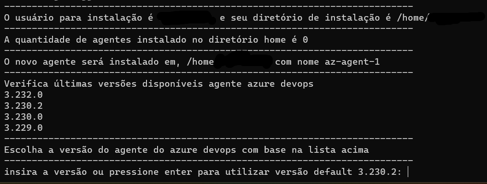
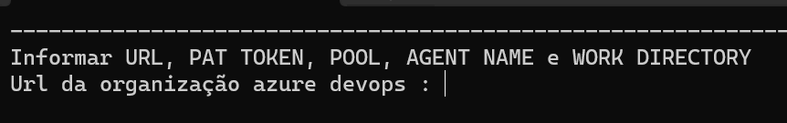
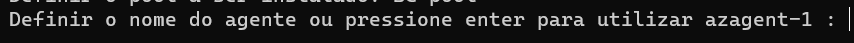
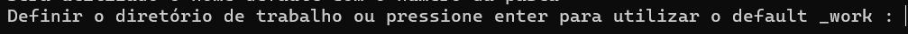
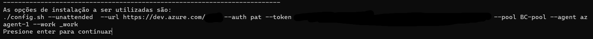
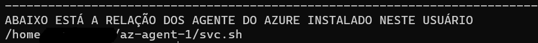

# SCRIPT PARA INSTALAR AGENT SELF HOSTED AZ EM LINUX
Objetivo deste script e automatizar o processo de instalação do agente do azure devops no modelo self hosted em vm linux.
## Etapas do script
* Validar e instalar dependências;
* Verificar versões disponíveis e listar;
* Verificar quantos agentes já foram instalado com base no nome **az-agent** e também se tem o binário **svc.sh**.
* Realizar o download e instalação;
  * A etapa de instalação por script direto necessita de incluir informações são elas:
    * Conexão do azure devops;
    * O PAT de autenticação;
    * O nome do pool quer será instalado o agente;
    * Definir o nome do agente ou utilizar o default;
    * O diretório padrão de trabalho do agente.
* Criar serviço de inicialização padrão SystemD e ativar para sempre iniciar caso a vm seja reiniciada;
* Listar todos os agentes instalados no usuário que foi utilizado para instalação.

## Instalação
* Baixe o script por aqui **[install-agent.sh](https://github.com/rpfreitas111/agente-azure-devops)**

* Após iniciar o script será informado o usuário que está sendo utilizado na instalação e local a ser instalado. Também irá mostrar a lista de versões do agente disponíveis  para ser escolhido na hora da instalação.
 

* Inserir as informações de conexão do agente

* Inserir URL de conexão do AZ. *A url e o endereço do azure devops seguido no nome da organização como neste exemplo* **https://dev.azure.com/minha-organização**
  

* A conexão o agente é realizado via chave PAT é necessário gerar uma chave com permissão total para o agente conseguir realizar as interações necessária da pipeline.
  

* Definir o nome do pool que será instalado, é importante verificar o nome corretamente que foi criado o pool. O nome do pool é encontrado dentro das configurações da organização na parte de agentes.
  

* Definir o nome a ser utilizado pelo agente, o padrão é utilizar **az-agent-1** o número refere a quantidade de agentes já instalados na mesma máquina e no mesmo usuário.  

* Definir o diretório de trabalho padrão, o recomendado pela azure é utilizar **_work** pois a pipeline já conhece este endereço.
  

* Ao final irá mostrar as configurações informada para realizar a instalação e conexão com o azure devops.
  

* Ao final irá mostrar alista de agentes instalados neste usuário. 

> A VALIDAÇÃO SE EXISTE USUÁRIO INSTALADO É UTILIZANDO O PADRÃO DE NOME **AZ-AGENT** E TAMBÉM  BUSCA O **SVC.SH** INSTALADO EM OUTROS LOCAIS.
